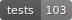

# Metrics Overview

Updated: 2026-07-06T18:27:53+00:00 (`a48eb81`)

## Tests

   

## Test Coverage

    

## Code Complexity Indicators

   
   

## Static Analysis

  

[Full detekt report](DETEKT.md)

## Code Churn (last 90 days)

| Hotspot | Changes |
|---|---|
| `engine-test/src/test/kotlin/com/mosedotten/json/migrator/engine/test/dsl/DslOperationTest.kt` | 8 |
| `engine-test/src/test/kotlin/com/mosedotten/json/migrator/engine/test/operation/OperationDescribeTest.kt` | 7 |
| `engine-test/src/test/kotlin/com/mosedotten/json/migrator/engine/test/dsl/DslClauseValidationTest.kt` | 7 |
| `engine/src/main/kotlin/com/mosedotten/json/migrator/engine/exception/MigrationException.kt` | 6 |
| `engine/src/main/kotlin/com/mosedotten/json/migrator/engine/operation/Document.kt` | 5 |
| `engine/src/main/kotlin/com/mosedotten/json/migrator/engine/operation/JsonPath.kt` | 3 |
| `engine-test/src/test/kotlin/com/mosedotten/json/migrator/engine/test/util/JsonFixtures.kt` | 3 |
| `engine/src/main/kotlin/com/mosedotten/json/migrator/engine/dsl/MigrationBuilder.kt` | 3 |
| `engine/src/main/kotlin/com/mosedotten/json/migrator/engine/operation/JsonPathNavigation.kt` | 2 |
| `engine/src/main/kotlin/com/mosedotten/json/migrator/engine/operation/Add.kt` | 2 |
