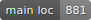
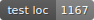
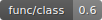
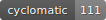
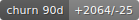

# Metrics Overview

Updated: 2026-07-05T20:24:09+00:00 (`ad346b0`)

## Test Coverage

    

## Code Complexity Indicators

   
   

## Static Analysis

  

[Full detekt report](DETEKT.md)

## Code Churn (last 90 days)

| Hotspot | Changes |
|---|---|
| `engine-test/src/test/kotlin/com/mosedotten/json/migrator/engine/test/operation/AddTest.kt` | 2 |
| `engine/src/main/kotlin/com/mosedotten/json/migrator/engine/operation/JsonPath.kt` | 2 |
| `engine-test/src/test/kotlin/com/mosedotten/json/migrator/engine/test/operation/SetTest.kt` | 1 |
| `engine-test/src/test/kotlin/com/mosedotten/json/migrator/engine/test/util/JsonFixtures.kt` | 1 |
| `engine/src/main/kotlin/com/mosedotten/json/migrator/engine/operation/Set.kt` | 1 |
| `engine/src/main/kotlin/com/mosedotten/json/migrator/engine/exception/MigrationException.kt` | 1 |
| `engine/src/main/kotlin/com/mosedotten/json/migrator/engine/operation/Add.kt` | 1 |
| `engine/src/main/kotlin/com/mosedotten/json/migrator/engine/operation/Document.kt` | 1 |
| `engine/src/main/kotlin/com/mosedotten/json/migrator/engine/operation/JsonPathNavigation.kt` | 1 |
| `engine/src/main/kotlin/com/mosedotten/json/migrator/engine/operation/Operation.kt` | 1 |
