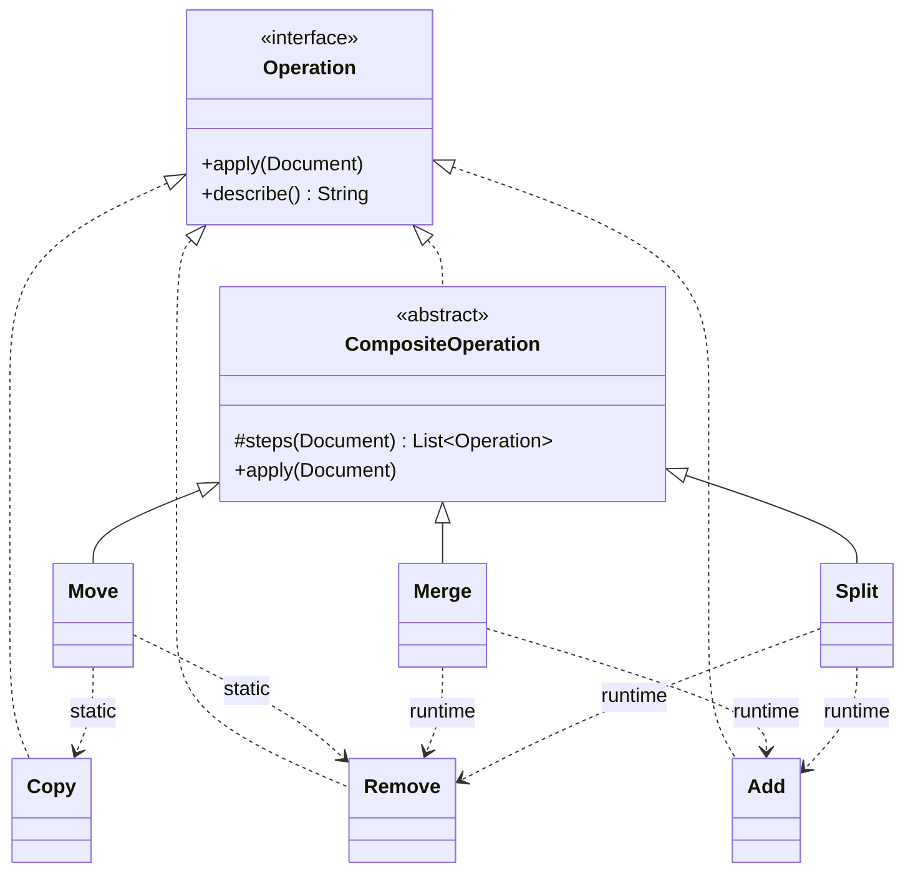

# Internals & design invariants

Contributor-facing notes on the rules every operation must follow. If you are *using* the engine,
read [Concepts](concepts.md) and the [Operations reference](operations.md) instead. This document
exists so new operations behave consistently with the existing ones.

## Operation model

Operations are the Command pattern:

```kotlin
interface Operation {
    fun apply(document: Document)
    fun describe(): String = javaClass.simpleName
}
```

- `apply` receives a [`Document`](#mutation-model), never a raw Jackson `ObjectNode`.
- `describe()` returns the user-facing DSL syntax (e.g. `move("/a") to "/b"`); it is used to attribute
  failures in `MigrationExecutionException`. Override it for anything a user writes in the DSL.
- Multi-step operations extend `CompositeOperation` and declare their `steps`:

  ```kotlin
  abstract class CompositeOperation : Operation {
      protected abstract fun steps(document: Document): List<Operation>
      final override fun apply(document: Document) = steps(document).forEach { it.apply(document) }
  }
  ```

  `steps` receives the document, so children may be **static** (`Move` → `Copy` + `Remove`) or
  **computed from runtime state** (`Merge`/`Split` build their `Add`/`Remove` children from the
  document contents).



`Add`, `Copy`, and `Remove` above are representative simple operations; `Set`, `Custom`, `Transform`,
`ForEach`, `CreateObject`, `RemoveIfEmpty`, `RequireExists`, and `RequireType` implement `Operation`
directly the same way.

**Rules**

- New multi-step operations extend `CompositeOperation`; do not hand-roll the apply loop.
- Every operation that maps to DSL syntax overrides `describe()`.

## Path semantics

Paths are a JSON Pointer subset (RFC 6901), modelled by the internal `JsonPath` value object.

- A path must start with `/`. The empty path (the document root) is invalid.
- Escapes: `~1` means a literal `/`, `~0` means a literal `~`.
- **Paths are parsed at construction time**, not at `apply` time. `JsonPath.parse` validates eagerly
  and throws `InvalidJsonPathException` before any document is touched.
- `JsonPath` is a pure value object (`raw`, `segments`, `leaf`, `parent`). It knows *which* field a
  path addresses; it performs no tree access. All navigation lives on `Document`.

**Rules**

- Parse each path in the operation's constructor (`private val jsonPath = JsonPath.parse(path)`), so a
  malformed path fails when the migration is built, not when it runs.
- Operations that delegate to other operations (e.g. `Move`) construct their child operations as
  constructor properties, so their paths are validated eagerly too.

## Mutation model

All reads and writes go through the `Document` facade over the root `ObjectNode`:

`exists` · `get` · `require` · `set` · `remove` · `ensureObject` · `children` · `mutate`

- **Structure is abstracted; values are not.** Navigation, escaping, and parent/leaf access are hidden
  behind `Document`/`JsonPath`, but field values remain Jackson `JsonNode`s. Do not invent a parallel
  value model.
- `set` creates missing parent objects along the path.
- Existence is **key presence**: a field explicitly set to `null` counts as present (`exists` is true,
  `get` returns a `NullNode`).
- Mutations happen in place on the tree.
- `mutate { root -> ... }` is the single sanctioned escape hatch for arbitrary Jackson code, used by
  the `custom` operation.

**Rules**

- Never touch `ObjectNode` directly outside `Document` (and `Custom`'s escape hatch).
- Keep values as `JsonNode`; use `Document` for every structural read/write.

## Failure guarantees & atomicity

- Operations fail fast with typed exceptions from `com.mosedotten.json.migrator.engine.exception`,
  all extending `MigrationException`. Common ones: `MissingFieldException`, `ExistingFieldException`,
  `InvalidFieldTypeException`, `InvalidFieldValueException`, `InvalidOperationException`,
  `InvalidJsonPathException`. Attribute failures to the offending path and use a label when helpful
  (e.g. `"Source field"`).
- **Migrations and schema runs are atomic by default.** Each migration snapshots the document before
  its operations and restores it on failure; the schema run wraps the whole chain the same way, so a
  later migration's failure rolls back earlier successful ones. Both are controlled by the `execution`
  strategy on `schema(...)` (default `ExecutionStrategy.Atomic`; pass `ExecutionStrategy.NonAtomic` to
  opt out of rollback).
- **`ExecutionStrategy` is a `fun interface`** (`dsl/ExecutionStrategy.kt`) wrapping a `block` in the
  chosen failure semantics: `Atomic` snapshots and rolls back, `NonAtomic` runs the block as-is. The
  strategy is threaded from `schema(...)` through `SchemaBuilder` and `MigrationBuilder.build(...)` into
  each `Migration`, and applied at both the schema-chain and per-migration boundaries.
- The rollback boundary catches **any `Throwable`** — including exceptions thrown by user lambdas in
  `Transform` and `Custom` — restores the document in place, and rethrows.
- `MigrationExecutionException` wraps a failing operation's `MigrationException` with `fromVersion`,
  `toVersion`, `operationIndex`, and `operationDescription` (from `describe()`).
- Because execution is atomic, pre-validation inside composite operations exists for **clear,
  attributed error messages**, not for safety — the atomic boundary already prevents partial mutation.

**Rules**

- Throw a typed `MigrationException` subtype with the offending path; never leak raw Jackson errors
  where a typed one fits.
- **Never implement your own rollback.** Rely on the atomic boundary.

## Checklist for a new operation

- [ ] Parse each path in the constructor via `JsonPath.parse`.
- [ ] Read and write only through `Document`; keep values as `JsonNode`.
- [ ] Throw a typed `MigrationException` subtype, attributed to the offending path.
- [ ] Override `describe()` with the user-facing DSL syntax.
- [ ] Extend `CompositeOperation` (declare `steps`) if the operation has more than one step.
- [ ] Do not add bespoke rollback — the migration/schema boundary handles it.
- [ ] Add an operation test (happy path + failure modes), a DSL happy-path test in `DslOperationTest`,
      and — if it introduces a DSL clause — a clause-validation test in `DslClauseValidationTest`.
- [ ] Document the operation in [`docs/operations.md`](operations.md) and add the README table row.
